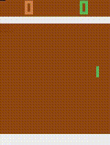
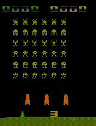

<h1>DQN in Atari 2600</h1>
Implementation of Deep Q-Network algorithm with Double, Dueling modules and Prioritized Experience Replay using PyTorch framework. 
It was tested in 3 Atari 2600 games: Pong, Breakout and Space Invaders.

<h2>Results</h2>

<h3>Pong</h3>

<h3>Breakout</h3>

<h3>Space Invaders</h3>

<h2>Trained models</h2>
This repository contains trained models for Pong, Breakout and Space Invaders. In order to run them, load the 
**`models/game_name`** in the "Seeing the results" section of the notebook.