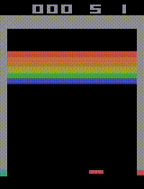

# DQN in Atari 2600
Implementation of Deep Q-Network algorithm with Double, Dueling modules and Prioritized Experience Replay using PyTorch framework. \
It was tested in 3 Atari 2600 games: Pong, Breakout and Space Invaders.

## Results

### Pong

### Breakout

### Space Invaders

## Trained models
This repository contains trained models for Pong, Breakout and Space Invaders. In order to run them, load the 
`models/game_name` in the "Seeing the results" section of the notebook.
